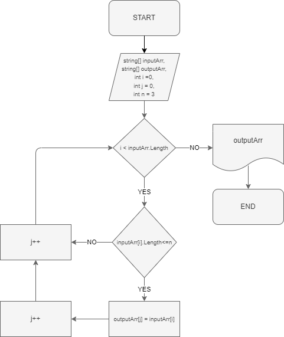

## Итоговый проект: ##
Задача: 
Написать программу, которая из имеющегося массива строк формирует массив из строк,
длина которых меньше либо равна 3 символа. Первоначальный массив можно ввести с
клавиатуры, либо задать на старте выполнения алгоритма. При решении не рекомендуется
пользоваться коллекциями, лучше обойтись исключительно массивами.

## Алгоритм решения ##
1. Перебираем значения исходного массива.
2. Проверяем каждое знаение массва по очереди на соответствие условию: длинна строки меньше или равна 3(трём).
3. Если условия выполняются, выбранной строкой из исходного массива то данное значение кладем в новый массив.
4. Повторяем пункты 2 и 3 до тех пор пока не достигнем конца исходного массива.
5. Возращаем новый заполненый массив как результат.

## Блок-схема алгоритма ##

## Программа ##

Программа расположена в папке Final_project. Для ее запуска неопходимо открыть файл Program.cs 
и выполнить ее через терминал.

После чего программа запросит ввести значения через запятую без использования пробела
например: Введите значения через запятую: 1234,1567,-2,computer science

Пример вывода программы: 
["1234", "1567", "-2", "computer science"] -> ["-2"]